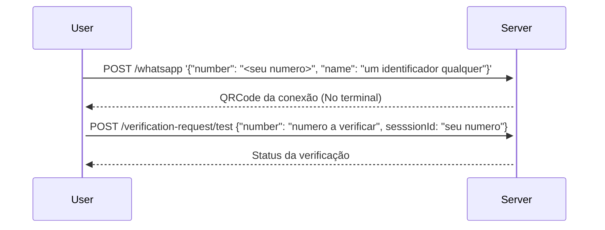

# Verify WPP

## Descrição

WIP: Um microsserviço simples de verificação de números de whatsapp

## Iniciando

1. Clone este repositório: `git clone https://github.com/JP-Go/verify-wpp-service.git`
2. Baixe as dependencias: `npm install`
3. Inicie o serviço com `npm run start:dev`
4. Aplicação será servida em http://localhost:3000

## Uso

Para realizar a verificação de números, é necessário informar um
número de telefone com WhatsApp. Este número fará as verificações por meio da
sua conexão com o WhatsApp.

